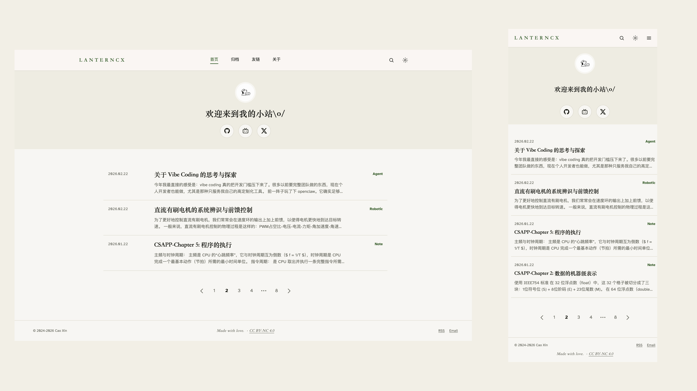
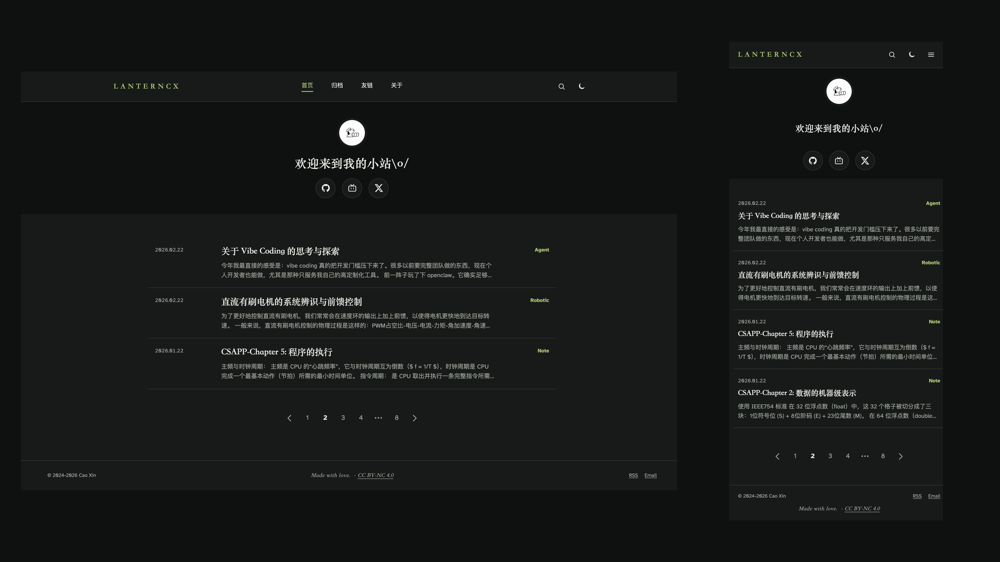

# Cao Xin 的小站

[English](docs/README-en.md)

一个基于 Astro、可直接接入 Obsidian Vault 的个人博客。

## 预览

访问 [www.caoxin.xyz](https://www.caoxin.xyz/)





## 关于这个小站

这个站基于 [Astro](https://github.com/withastro/astro) 和我自己设计的博客主题 [LanternCX/Site](https://github.com/LanternCX/Site) 搭建

我在 2026 年 8 月完成了这个站的基本设计和开发，于是从原来的 [Typecho](https://typecho.org/) 引擎 + [Akina-for-Typecho
](https://github.com/Zisbusy/Akina-for-Typecho) 主题迁移到了当前架构

[LanternCX/Site](https://github.com/LanternCX/Site) 仓库中独立实现了对 [Obsidian Callout](https://obsidian.md/help/callouts) 等语法进行解析的 [remark](https://github.com/remarkjs/remark) 插件，并参考一些 [Obsidian Theme](https://community.obsidian.md/search?type=theme) 绘制了前端样式

在 [LanternCX/Site](https://github.com/LanternCX/Site/tree/main/src/content) 中链接博客的 [Obsidian Vault](https://obsidian.md/help/vault) 仓库 [LanternCX/Bolgs](https://github.com/LanternCX/Blogs) 后，借助 [Github Actions](https://github.com/features/actions) 实现了 Astro 静态网页的构建、测试以及自动发布，实现了非常丝滑的写作和发布体验

因此你可以直接通过 [Obsidian](https://obsidian.md) 作为一个 Vault 打开 [LanternCX/Bolgs](https://github.com/LanternCX/Blogs) 阅读我的博客

首页 Hero 的动态字幕用的是 [typewriterjs](https://github.com/tameemsafi/typewriterjs)

评论交互系统用的是 [Giscus](https://github.com/giscus/giscus)

全程使用 [GPT](https://chatgpt.com/overview) 系列模型与 [Codex](https://chatgpt.com/codex) 设计与构建

这个小站目前的打算是用作我的个人博客，写点技术文章，以及稍微记录一下我的生活

## 快速开始

需要 Node.js 22.12 或更高版本。克隆仓库后，将博客内容子模块指向你自己的 Obsidian Vault：

```sh
git clone https://github.com/LanternCX/Site.git
cd Site
git submodule set-url src/content/blog <你的 Vault Git 地址>
git submodule update --init --remote src/content/blog
npm install
npm run astro -- dev --background
```

Vault 需要是一个 Git 仓库，其中的 Markdown 或 MDX 文章至少包含以下 Frontmatter：

```yaml
---
title: 文章标题
pubDate: 2026-08-11
---
```

随后修改以下内容完成个性化：

- 在 `src/consts.ts` 中设置站点名称、作者、简介和关键词。
- 在 `astro.config.mjs` 中设置正式域名。
- 在 `src/components/HomePage.astro` 中修改头像、欢迎语和社交链接。
- 在 `src/content/pages` 中修改 About 和 Friends 页面。

## 开发

```sh
npm install
npm run astro -- dev --background
```

后台开发服务器可以通过以下命令管理：

```sh
npm run astro -- dev status
npm run astro -- dev logs
npm run astro -- dev stop
```

## 验证

```sh
npm test
npm run build
```
